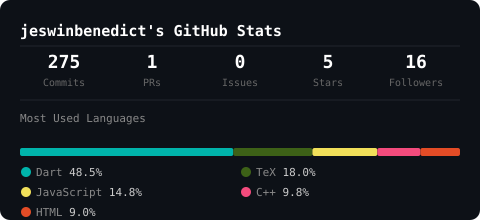

# Jeswin Karunya Benedict
Full-Stack Developer — Tamil Nadu, India

---

Building software across the full stack: from systems-level C++ to cross-platform mobile applications.

---

## GitHub Stats

  

---

## Connect

[LinkedIn](https://www.linkedin.com/in/jeswin-karunya-benedict)
